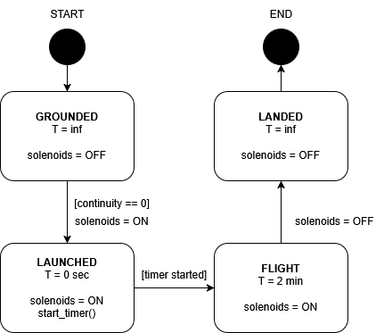

# Valve Control Board

This is the software responsible for maintaining control of the solenoid valves XV-4, XV-6 and XV-7 during flight.

It does the following:

1. Wait for the continuity line to read low (disconnected)
2. Turn on the MOSFET switches that output 24V battery power on the solenoid power lines
3. Begin a timer for the flight duration (configurable, somewhere in the minutes range)
4. Once the timer ends, turn off the MOSFET switches

This code is written in bare-metal C to be as low-resource as possible, while still making use of the AVR build
tool-chain conveniences. Should also be more legible than assembly.

## Visualization

This is a visualization of the valve control logic using Finite State Machine (FSM) notation:



## Building

In order to build this project, you need the AVR C tool chain. Install it for your system, then run `make`.

## Flashing

In order to flash the MCU with this program, you'll want to install the `avrdude` utility. This is the same utility that
the Arduino IDE uses under the hood for flashing AVR devices.

Once installed, you need to plug in your programmer to your host machine, and connect it properly to the ATTiny85. The
ATTiny85 uses ICSP for programming, so you can put it in a bread-board with jumper wires from its pins to the
corresponding pins on your programmer. Check online for tutorials to see how to do this properly.

Once everything is set up, run the following commands in sequence:

```console
$ make fuses
$ make upload
```

`make fuses` will set the clock divider settings for the device, and keep all other default settings.

`make upload` will generate the program's `.hex` file and flash the device through your programmer. The Makefile is
configured to use the `usbtiny` programmer type. If you're using something else to flash the MCU, modify the Makefile
`PROGRAMMER` variable to the programmer you're using.

To see a list of valid programmer options, run `avrdude -c ?`.
